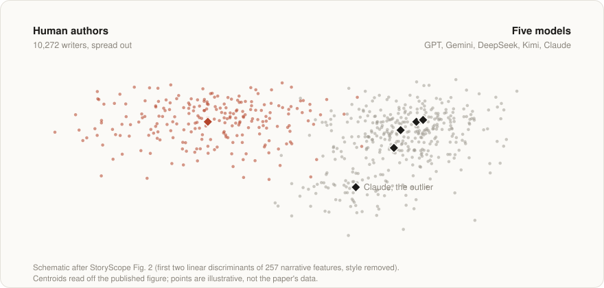

<picture>
  <source media="(prefers-color-scheme: dark)" srcset="assets/hero-dark.svg">
  
</picture>

# humanizing

An agent skill that fixes the structural tells of AI writing: the moral explained at the end, events told in the order they were discovered, every loose end tied, allusions where names should be.

Word lists catch "delve" and em-dash floods, and newer models already avoid those. Structure is what still gives the text away. StoryScope ([Russell et al., COLM 2026](https://arxiv.org/abs/2604.03136)) told human from AI fiction at **93.2% macro-F1 using narrative choices alone**, with every style feature removed. This skill turns those findings into rules an agent applies while it writes.

It works with Claude Code, Codex, Cursor and any harness that reads `SKILL.md`. Run it alongside a word-level pass like [unslop](https://github.com/theclaymethod/unslop) or [Humanizer](https://github.com/blader/humanizer), not instead of one.

## The rules

| # | Default to break | AI | Human | Instead |
|---|---|---|---|---|
| 1 | States the moral | 77% | 52% | End on the last fact or the next action |
| 2 | Alludes instead of naming | 72% | 50% | File, line, number, title, street |
| 3 | Emotion only through the body | 81% | 38% | Say it plainly when plain is accurate |
| 4 | Tells it in order | 2.1/5 | 2.4/5 | Conclusion first, trail after |
| 5 | Resolves it all inside the character | 47% | 27% | State what is open or unverified |
| 6 | No subplots, even sections | 79% | 57% | Size each part by its weight |
| 7 | Writes to no one | 7% | 28% | Know the reader, talk to them |

Rates are from StoryScope's fiction corpus (Table 16): 10,272 published human stories against the same premises written by five models. Row 4 rates time jumps from 1 (linear) to 5. For docs, PRs and chat the rules are extrapolations of the same defaults, not measured results. [`SKILL.md`](SKILL.md) has the full rule text and the process.

<picture>
  <source media="(prefers-color-scheme: dark)" srcset="assets/map-dark.svg">
  
</picture>

<sub>Schematic after StoryScope Fig. 2 (first two linear discriminants of 257 narrative features, style removed). Centroids read off the published figure; points are illustrative, not the paper's data.</sub>

The models converge. In narrative-feature space the five sit together, with Claude a little apart, and the human stories spread out around them. Average human-to-AI centroid distance is 1.6× the AI-to-AI distance.

## Install

```bash
npx skills add rodniski/humanizing
```

Or clone it into your skills folder:

```bash
git clone https://github.com/rodniski/humanizing ~/.claude/skills/humanizing
```

## Use

The skill triggers on its own when an agent writes or reviews long prose, or when you say text "sounds like AI". You can also call it directly:

```text
/humanizing review  README.md     flag tells, change nothing
/humanizing rewrite <text>        restructure, keep every fact
/humanizing draft   <brief>       write with the rules applied from line one
```

## Before and after

<details>
<summary><b>Chat answer</b>: discovery order, vague allusion, moral at the end</summary>

```diff
- I looked into the login timeouts. First I checked the application logs, then
- the load balancer config, and then the database connection pool. As
- experienced engineers often say, it's usually the simplest thing. In the end,
- the issue turned out to be the pool size. Ultimately, this shows how small
- configuration details can have a big impact on reliability.
+ Login times out because the DB pool caps at 10 connections (config/db.go:42).
+ I raised it to 50 and p99 dropped from 8.1 s to 240 ms. Not checked yet:
+ whether the cache layer hides the same limit under real traffic.
```
</details>

<details>
<summary><b>PR description</b>: template symmetry, no specifics</summary>

```diff
- ## Summary
- This PR improves the reliability of the notification system.
- ## Changes
- - Refactored the retry logic
- - Updated the queue configuration
- - Added tests
- ## Impact
- These changes make notifications more robust and ensure a better experience.
+ Push notifications were dropped whenever APNs returned 429, because the retry
+ ran once with no backoff. Retries now back off exponentially (max 5,
+ retry.go), and the queue keeps failed jobs for 24 h instead of discarding them.
+
+ Tested against a mocked 429 storm. Not tested on Android/FCM, which uses a
+ different path.
```
</details>

<details>
<summary><b>Fiction</b>: stated theme, tightening chest, linear time</summary>

```diff
- Maria stood at the edge of the pier as the sun sank low. Her chest tightened
- with every wave that broke against the wooden posts, the salt air carrying
- memories of her father. She had spent years running from this place. But now,
- watching the light fade, she finally understood: home was never a place. It
- was the people who had loved her, and the courage to return.
+ The pier had been repainted, which made her angry before she knew why. Her
+ father had hated that green. She told the man at the bait shop she was only
+ passing through, and that was a lie too, though not the one he thought.
+
+ Two winters earlier, she had sold his boat to a dentist from Porto Alegre.
```
</details>

More pairs, including email, docs and an over-correction to avoid, are in [`references/examples.md`](references/examples.md).

## What this is not

- **Not a detector bypass.** In the same paper, a fine-tuned classifier on raw text still separated human from AI at 99.9%. Structure is one layer of many. This is about writing better, not hiding anything.
- **Not settled science for non-fiction.** The evidence comes from short fiction. The non-fiction rules apply the same defaults by analogy.
- **Not free of the paper's caveats.** StoryScope generated AI stories from premises reverse-engineered out of the human stories. A 120-word premise that states the theme and keeps one conflict probably inflates rules 1, 4 and 6. The human side is published, edited anthology fiction spanning decades, compared against single-pass drafts. The diversity gap compares 10,272 authors with five models. The skill leans on the findings that survive those caveats best: named references, plain emotion labels, open endings.

## Credits

Built on the findings of:

```bibtex
@inproceedings{russell2026storyscope,
  title     = {StoryScope: Investigating idiosyncrasies in AI fiction},
  author    = {Russell, Jenna and Rajendhran, Rishanth and Pham, Chau Minh
               and Iyyer, Mohit and Wieting, John},
  booktitle = {Conference on Language Modeling (COLM)},
  year      = {2026},
  eprint    = {2604.03136},
  archivePrefix = {arXiv},
  url       = {https://arxiv.org/abs/2604.03136}
}
```

Their code and data: [jenna-russell/storyscope](https://github.com/jenna-russell/storyscope). The images in `assets/` are generated by [`scripts/build_assets.py`](scripts/build_assets.py).

## License

[MIT](LICENSE)
